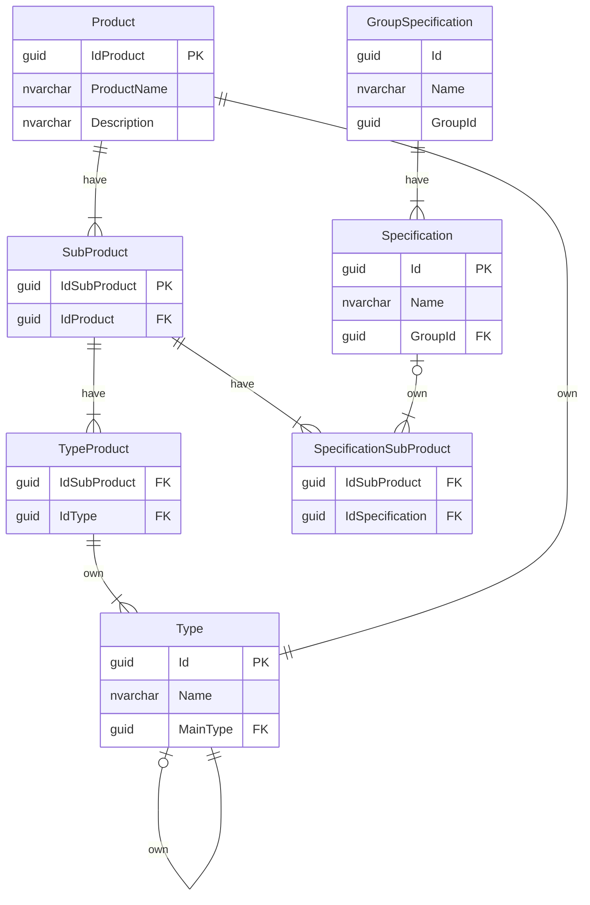

# Database

```mermaid
erDiagram
Product{
    guid IdProduct PK
    nvarchar ProductName
    nvarchar Description

}

SubProduct{
    guid IdSubProduct PK
    guid IdProduct FK
}

TypeProduct{
    guid IdSubProduct FK
    guid IdType FK
}

Specification{
    guid Id PK
    nvarchar Name
    guid GroupId FK
}

SpecificationSubProduct{
    guid IdSubProduct FK
    guid IdSpecification FK
}

GroupSpecification{
    guid Id
    nvarchar Name
    guid GroupId
}

Type{
    guid Id PK
    nvarchar Name 
    guid MainType FK
}

Product ||--|{ SubProduct : have
SubProduct || -- |{ TypeProduct : have
SubProduct || -- |{ SpecificationSubProduct : have
Specification o| -- |{ SpecificationSubProduct : own
TypeProduct || -- |{ Type : own
Product || -- || Type : own
Type o| -- || Type : own
GroupSpecification || -- |{ Specification : have

```