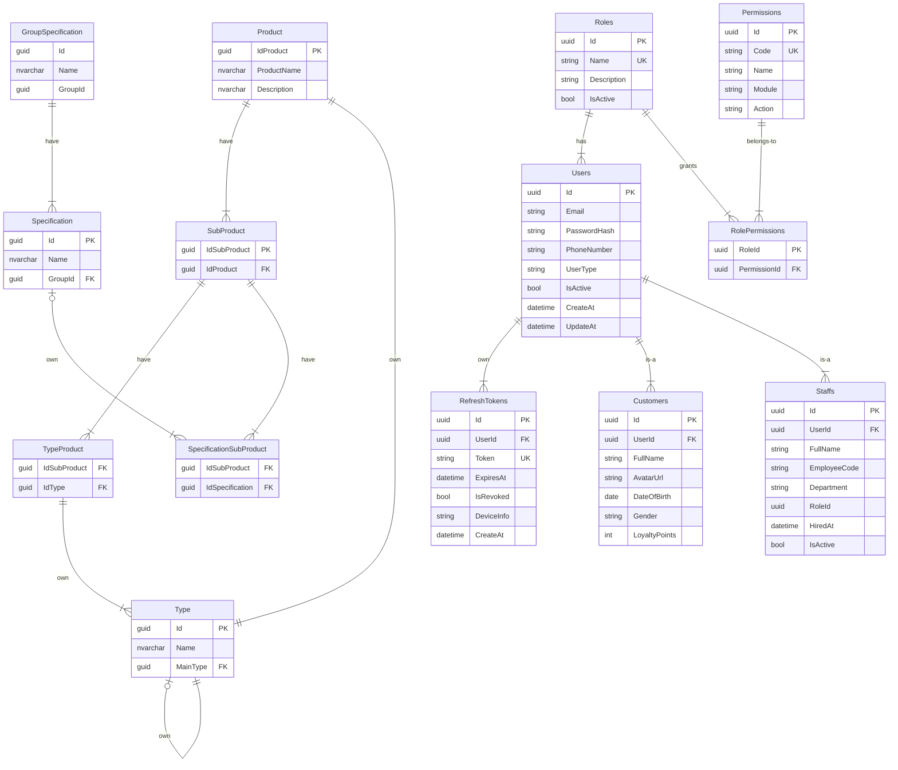

# Setup
- change `TopZoneDb` in appsettings.json
- Open Package Manage Console and Run Command Line `Update-Database -Project Infrastructure -StartupProject TopZone`
- Or run on Terminal `dotnet ef database update --project Infrastructure --startup-project TopZone`
- Check DB

# Database

