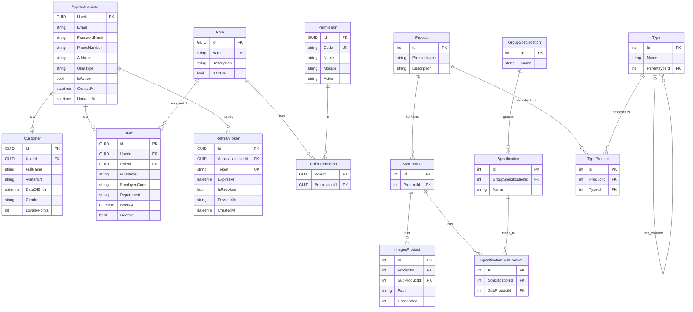

# Setup
- change `TopZoneDb` in appsettings.json
- Open Package Manage Console and Run Command Line `Update-Database -Project Infrastructure -StartupProject TopZone`
- Or run on Terminal `dotnet ef database update --project Infrastructure --startup-project TopZone`
- Check DB Migration: `Get-Migration`
- Add Migration `Add-Migration InitialMigraiton -Project Infrastructure -StartupProject TopZone -OutputDir Migrations`
- Remove Migration with Package Manager: `Remove-Migration` Start up project is `TopZone`, Default project is `Infastructure`
# Database

